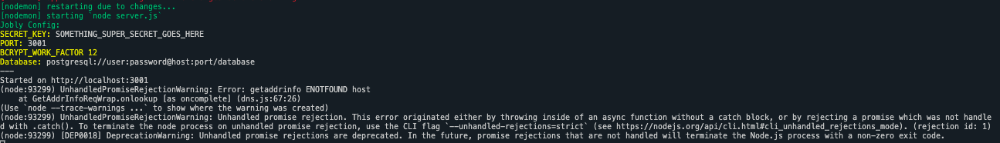

# Express Jobly Solution from Rithm School

This is the backend for the Jobly application using Node, Express.js, and PostgreSQL.

## Dev Setup

Copy the `.env.template` into a `.env` file.

```bash
cp .env.template .env
```

And fill in the appropriate env vars:

```bash
DATABASE_USER=postgres
DATABASE_PASS=postgres
DATABASE_HOST=localhost
DATABASE_PORT=5432
DATABASE_NAME=jobly
DATABASE_TEST_NAME=jobly_test
```

These should be updated with values needed for your postgres connection string.

Then setup the database by running `psql -f jobly.sql`.

Run `npm install` or `yarn install` to get the appropriate dependencies.

Start up the server in dev with `npm run dev` or `yarn run dev`.

## Pitfalls

If you see an error message like this:



That means your connection string to postgres isn't working as expected. Debugging that issue can be difficult at time.
